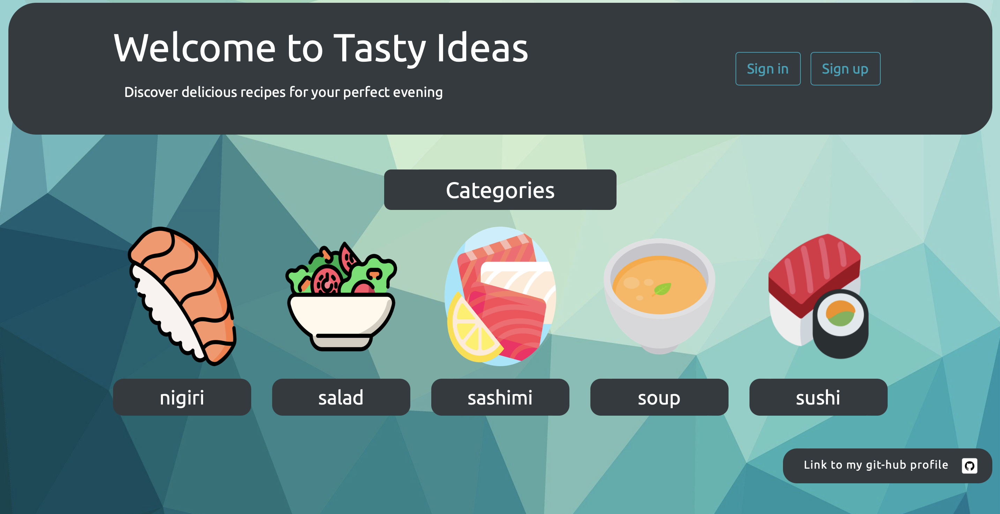

# Tasty Ideas

An app that provides users with a vast collection of delicious recipes from around the world. Discover new tasty ideas and expand your culinary horizons with this recipe app.

# Check it out!

https://tasty-ideas-proj.onrender.com
 
# Demo 


# File includes data.json so you can load data to database

# Set up environment variables
    - Create a `.env` file in the root directory of the project.
    - Add the following variables to the `.env` file:
        ```env
        SECRET_KEY=your_secret_key
        DEBUG=True  # Set to False in production
        ```

# User data for login

    login: user
    password: user12345

# Python3 must be already installed

``` shell
git clone https://github.com/mikhailyemets/tasty-ideas-proj.git
cd tasty_ideas_proj
python3 -m venv venv (mac) 
python -m venv venv (win)
source venv/bin/activate (mac)
venv\Scripts\activate(win)
pip install -r requirements.txt
python manage.py runserver

## All features

# Categories
- Display Categories: The main page (index) displays all available recipe categories.

- List Recipes by Category: On each category page, recipes belonging to that category are displayed with a search functionality to filter recipes by name or ingredients.

- Detail recipe page for more information about choosen recipe

# Recipes
- View Recipes: Each recipe can be viewed in detail, including its name, difficulty, cooking time, ingredients, and recipe instructions.

- Create Recipes: Authenticated users can add new recipes to a category.
- Update Recipes: Authenticated users can update existing recipes they have added.
- Delete Recipes: Authenticated users can delete recipes they have added.

# Reviews
- Add Reviews: Authenticated users can add reviews to recipes.

- Delete Reviews: Users can delete their own reviews.

# User Profiles
- User Registration: New users can sign up for an account.

- User Authentication: Existing users can log in and out.

- User Profile Management: Users can view and update their profile information.

# Search Functionality
- Search Recipes: Users can search for recipes by name or ingredients within a category.

# Pagination
- Paginated Recipe List: The recipe list is paginated to improve user experience and manageability.

# Forms
- Search Form: A form to search for recipes within a category.

- Commentary Form: A form to add reviews to recipes.
- Recipe Form: Forms for creating and updating recipes.
- User Profile Form: A form for updating user profile information.

# Messages
- User Feedback: The application provides feedback messages to users for actions like adding reviews, requiring login, and form validation.

# Admin
- Admin Interface: Django admin is used for managing the application data.


